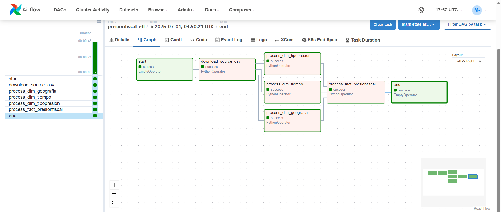
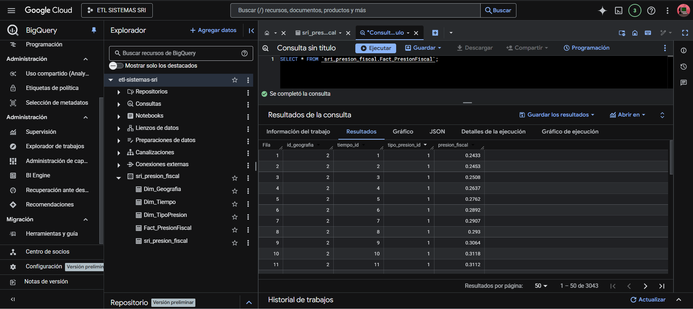
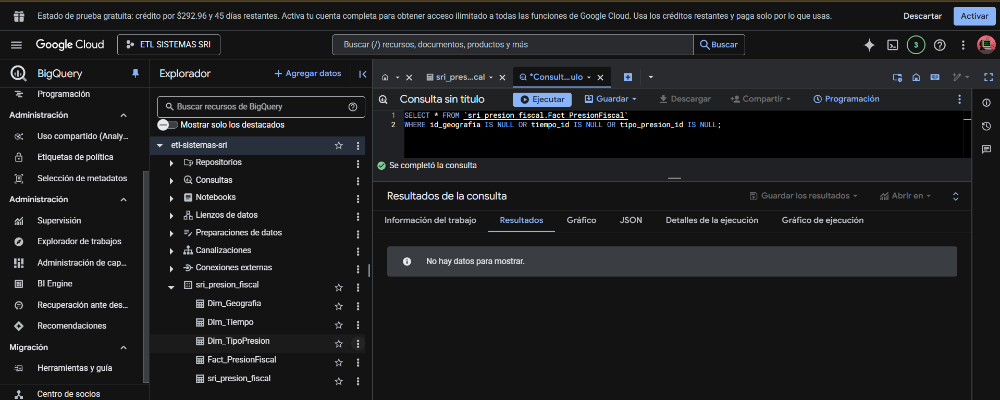
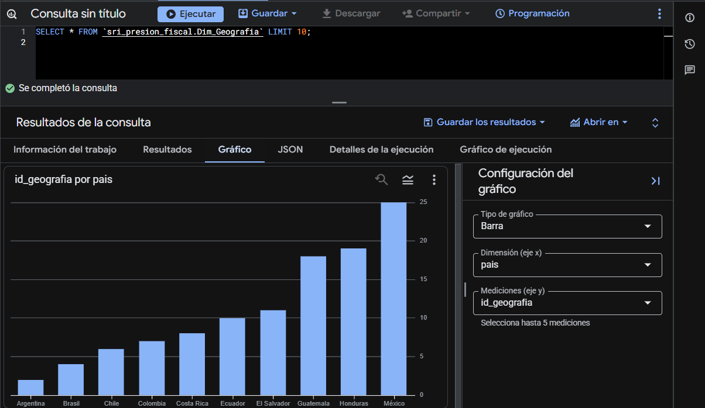

# PresionFiscalETL

Pipeline ETL diseñado para automatizar la extracción, transformación y carga de datos de presión fiscal en países de América Latina y Europa. El sistema está implementado en Google Cloud Platform (GCP) utilizando **Apache Airflow (Cloud Composer)**, **BigQuery**, y **Cloud Storage**, lo que permite una integración escalable, reproducible y trazable de datos abiertos publicados por el Servicio de Rentas Internas del Ecuador (SRI).

---

## Objetivo General

Automatizar la ingesta y transformación de datos sobre presión fiscal en un esquema de Data Warehouse basado en modelo dimensional (estrella), permitiendo consultas analíticas eficientes y la generación de reportes OLAP sobre la carga tributaria de los países registrados.

---
## Herramientas y Tecnologías Utilizadas

Este proyecto fue desarrollado utilizando un conjunto moderno de herramientas para la automatización del proceso ETL en la nube:

- **Google Cloud Platform (GCP)**: Plataforma principal de infraestructura en la nube.
- **Google BigQuery**: Motor de análisis de datos a gran escala, usado como Data Warehouse.
- **Google Cloud Storage (GCS)**: Almacenamiento de objetos, usado para guardar el archivo CSV fuente.
- **Apache Airflow (Cloud Composer)**: Orquestador de flujos de trabajo ETL, gestionando tareas dependientes.
- **Google Colab**: Entorno de desarrollo interactivo utilizado para pruebas y desarrollo inicial de scripts.
- **Python 3**: Lenguaje principal para el desarrollo del pipeline.
- **Pandas**: Librería de análisis y transformación de datos.
- **PyArrow**: Backend utilizado por pandas para exportar datos a BigQuery.
- **google-cloud-bigquery**: Cliente oficial de Python para trabajar con BigQuery.
- **google-cloud-storage**: Cliente oficial de Python para interactuar con GCS.
- **google-auth**: Autenticación mediante credenciales de cuenta de servicio para conexión segura con GCP.


## Arquitectura del Proyecto

```
+---------------------+       +---------------------------+       +---------------------------+
|   📥 Descarga CSV   | ----> |  ☁️ Google Cloud Storage  | ----> | 🛠️ Apache Airflow (DAG ETL) |
|     (SRI Ecuador)   |       |     (Archivo Fuente)      |       |     (Transformaciones)     |
+---------------------+       +---------------------------+       +---------------------------+
                                                                          |
                                                                          v
                                                                +---------------------+
                                                                |   📊 BigQuery DW     |
                                                                |  (Modelo Estrella)   |
                                                                +---------------------+
                                                              
```

### Componentes Principales

| Componente        | Descripción                                                                 |
|-------------------|-----------------------------------------------------------------------------|
| Google Cloud Storage | Almacena el archivo CSV descargado del SRI.                              |
| Apache Airflow (Cloud Composer) | Orquesta y automatiza el pipeline ETL con tareas programadas. |
| BigQuery          | Almacena las tablas del modelo dimensional para análisis OLAP.              |
| Python + Pandas   | Realiza transformaciones y validaciones sobre los datos.                    |

---

## Modelo Dimensional - Esquema Estrella

| Tabla                 | Descripción                                   |
|-----------------------|-----------------------------------------------|
| `Fact_PresionFiscal`  | Métricas de presión fiscal.                   |
| `Dim_Geografia`       | Dimensión geográfica (País, Región).          |
| `Dim_Tiempo`          | Dimensión temporal (Año).                     |
| `Dim_TipoPresion`     | Tipo de presión fiscal reportada.             |

---

## 🛠️ Requisitos del Entorno

### 1. Infraestructura en GCP

- Proyecto en Google Cloud creado y habilitado.
- Bucket en Cloud Storage creado (ej: `us-central1-etl-composer-XXXX-bucket`).
- Dataset en BigQuery: `sri_presion_fiscal`.

### 2. IAM (Roles y Permisos)

Debe crearse una **Cuenta de Servicio** con los siguientes roles:

- `roles/bigquery.dataViewer`: Visualizador de datos en BigQuery.
- `roles/bigquery.jobUser`: Permite ejecutar jobs de carga y consultas.
- `roles/storage.admin`: Acceso total al bucket donde se almacenan archivos.
- (Opcional) `roles/composer.worker`: Si deseas integrarlo completamente con Cloud Composer.

> 💡 Guarda la clave de esta cuenta de servicio en formato `.json`.

### 3. Librerías Python requeridas

```
pip install pandas pyarrow requests
pip install google-cloud-bigquery google-cloud-storage google-auth google-auth-oauthlib
```

### 4. Archivo de Credenciales

Sube el archivo de clave JSON al siguiente path en tu entorno Airflow:

```
/home/airflow/gcs/data/credentials/etl-sistemas-sri-xxxx.json
```

---

## Estructura del DAG en Airflow

```
presionfiscal_etl
├── start
├── download_source_csv
├── process_dim_geografia
├── process_dim_tiempo
├── process_dim_tipopresion
├── process_fact_presionfiscal
└── end
```

### Funciones de cada tarea:

| Tarea                          | Función principal                                                           |
|--------------------------------|------------------------------------------------------------------------------|
| `download_source_csv`         | Descarga el archivo CSV desde el portal del SRI.                            |
| `process_dim_geografia`       | Extrae datos únicos de país y región, genera claves y carga a BigQuery.     |
| `process_dim_tiempo`          | Extrae años únicos y crea la dimensión temporal.                            |
| `process_dim_tipopresion`     | Genera dimensión para los tipos de presión fiscal.                          |
| `process_fact_presionfiscal`  | Realiza joins con dimensiones, transforma métricas y carga los hechos.      |

---

## Ruta de Subida del DAG

Asegúrate de subir tu archivo `.py` del DAG a la siguiente ruta de Cloud Storage:

```
gsutil cp presionfiscal_etl_dag.py gs://us-central1-etl-composer-XXXX-bucket/dags/
```

Y las credenciales a:

```
gsutil cp etl-sistemas-sri-xxxx.json gs://us-central1-etl-composer-XXXX-bucket/data/credentials/
```

---

## 🔍 Resultados Esperados

- Tablas `Dim_*` y `Fact_*` correctamente pobladas en BigQuery.
- Datos limpios, validados y sin valores nulos.
- Historial de ejecuciones exitosas del DAG visible en Airflow.
- Posibilidad de realizar consultas OLAP para análisis fiscal.

---

## Evidencias de funcionamiento

- Captura del DAG ejecutándose con éxito en Airflow.
  
  
  
- Conteos de registros por tabla en BigQuery.
  
   
  
- Ejemplo de consulta SQL para validación de relaciones entre dimensiones y hechos.
  
  

- Ejemplo de gráfico generado (si aplica) a partir de los datos del DW.
  
  
  

---

## 📚 Recursos Adicionales

- [Documentación oficial de Airflow](https://airflow.apache.org/docs/)
- [BigQuery Python Client](https://cloud.google.com/bigquery/docs/reference/libraries#client-libraries-install-python)
- [Servicio de Rentas Internas (SRI)](https://www.sri.gob.ec)

---

## 👩‍💻 Autora

**Miryam Alexandra Guerrero Gaibor**  
Estudiante de Ingeniería de Software - Proyecto Académico  
---

---

